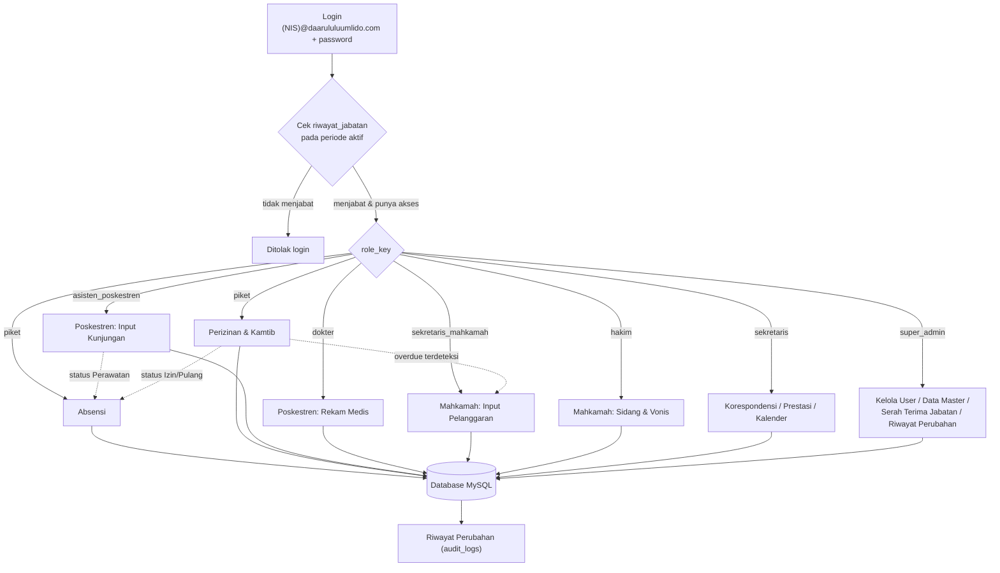

# Perkuat dari dasar (flowchart)
### Silahan revisi ulang flowchartnya, abaikan jabatan, fokus kepada objek (sistem yang abadi tetap berjalan dan diperlukan dalam kegiatan HISADA)
### Ringkasan Singkat Alur (Software Development Life Cycle (SDLC)) : Mindmap (Ide Besar) ➔ Analisis (Detail Fitur) ➔ Flowchart (Logika Jalannya Program) ➔ Desain Database (Penyimpanan Data) ➔ Coding (Pembuatan Program) ➔ Testing (Pengecekan Error) ➔ Deployment (Rilis Aplikasi).

# Sistem Hisada
### Himpunan Santri Daarul Uluum Lido — Sistem Informasi Manajemen Kesantrian

Dibangun dengan PHP native + MySQL/MariaDB, tanpa framework, tanpa build-tool JavaScript. Semua aset front-end (Bootstrap 5, Bootstrap Icons) di-vendor lokal — tidak ada dependensi ke CDN eksternal.

---

## Flowchart Sistem



---

## 1. Autentikasi & RBAC

- **Hanya santri yang sedang menjabat** (punya baris di `riwayat_jabatan` dengan `punya_akses_sistem = 1` pada periode aktif) yang bisa login.
- Login pakai **email `(NIS)@daarululuumlido.com` + password**, bukan NIS polos.
- Role (`role_key`) dicek lewat **join ke `riwayat_jabatan` pada periode jabatan yang sedang aktif** — bukan kolom statis di tabel `users`. Begitu Serah Terima Jabatan dilakukan, hak akses seluruh pengurus lama otomatis berubah tanpa admin perlu edit satu-satu.
- Password di-hash **Bcrypt**.
- Error tak terduga (exception, kolom/tabel hilang, dsb.) ditangani lewat *global exception handler* — pengguna tidak pernah melihat stack trace PHP mentah, diganti halaman error kustom yang konsisten dengan desain aplikasi (403 Akses Ditolak, 422 Data Tidak Lengkap, 500 kendala teknis / skema database belum sesuai).

## 2. Dashboard

- Statistik satu baris: jumlah santri **laki-laki / perempuan / total**.
- Statistik tambahan: sakit (30 hari terakhir), status pulang hari ini, alpha hari ini.
- Daftar kegiatan mendatang dari Kalender Akademik.

## 3. Modul Absensi

- Kartu pilihan: **Harian (Kamar)**, Halaqah Qur'an, Muhadhoroh, Olahraga, Kesenian.
- **Absensi Harian**: filter **langsung satu dropdown Kamar** (menampilkan label "Gedung - Kamar") — tidak ada lagi filter Gender/Gedung terpisah, cukup pilih kamar langsung. Filter otomatis submit begitu kamar/tanggal dipilih, tanpa tombol.
- **Absensi kegiatan lain**: berbasis keanggotaan grup (ekskul untuk Olahraga/Kesenian, grup kegiatan untuk Halaqah/Muhadhoroh).
- Status absensi harian sebagian besar **terisi otomatis** dari modul lain (Poskestren → Sakit, Perizinan → Izin/Pulang/Alpha).

## 4. Modul Poskestren (Klinik)

- Dua jenis kunjungan: **Rawat Jalan** (konsultasi saja, tidak mengubah status absensi) dan **Perawatan** (status absensi hari itu otomatis jadi "Sakit").
- Status "Sakit" hanya berlaku untuk tanggal itu saja — otomatis kembali "Hadir" esoknya kecuali diisi ulang.
- Dokter melihat antrean pemeriksaan + mengisi rekam medis (diagnosa/resep/tindak lanjut).
- **Analisis musim sakit**: tren kunjungan 6 bulan terakhir + keluhan terbanyak, membantu deteksi pola penyakit musiman.

## 5. Modul Mahkamah Santri

- Sekretaris input pelanggaran (kategori, keterangan, santri) → masuk antrean sidang.
- Hakim memvonis **Ringan/Sedang/Berat**, atau melakukan **pemutihan** (soft-delete + alasan pembatalan, bukan hapus permanen — audit trail tetap ada).

## 6. Modul Perizinan & Kamtib

Tiga jenis izin, masing-masing basis waktu berbeda:

| Jenis | Basis Waktu | Catatan |
|---|---|---|
| **Keluar Sementara** | Jam (hari ini) | Mulai otomatis dari jam saat input, sampai jam yang ditentukan (mis. 16:00) |
| **Izin Dinas** | Tanggal + Jam | Bisa lintas hari (mis. berangkat besok pagi, pulang lusa sore) |
| **Pulang** | Tanggal saja | Rentang tanggal seperti biasa |

- Deteksi **overdue otomatis** (kombinasi tanggal+jam untuk Keluar Sementara/Izin Dinas) → status jadi Overdue, absensi jadi Alpha, otomatis masuk antrean Mahkamah kategori Keamanan.
- **Cetak surat izin** — halaman print mandiri per pengajuan izin (kop surat, data santri, kolom tanda tangan).
- Konfirmasi kembali untuk menutup izin yang sudah selesai.

## 7. Modul Korespondensi

- **Surat keluar: nomor diketik manual** oleh sekretaris (bukan lagi digenerate otomatis) — ditolak dengan pesan jelas kalau nomornya sudah dipakai surat lain.
- Surat masuk: nomor manual + status disposisi (Belum Dibaca/Diteruskan/Disetujui/Diarsipkan).
- Validasi regex lampiran: hanya menerima URL Google Docs resmi.

## 8. Modul Prestasi Santri

- Input: santri, nama kegiatan, lokasi, tingkat (internal/eksternal), keterangan, tanggal.

## 9. Modul Kalender Akademik

- Empat mode tampilan: **1 Bulan, 2 Bulan, 1 Semester, 2 Semester**.
- **1 Semester** dan **2 Semester** ter-*anchor* otomatis ke batas Januari/Juli (bukan sekadar N bulan dari tanggal yang sedang dilihat):
  - 1 Semester → Januari–Juni **atau** Juli–Desember, tergantung bulan yang sedang dilihat.
  - 2 Semester → satu tahun ajaran penuh Juli–Juni.
- Klik tanggal kosong → popup tambah agenda, kategori **Umum/Akademik/Pengasuhan** (bisa pilih 2 sekaligus), warna berbeda per kategori. Minimal satu kategori wajib dipilih (divalidasi server-side, bukan cuma di JS).
- Bisa **dicetak** langsung dari browser.
- Hanya **sekretaris dan admin** yang bisa menambah/mengubah agenda; role lain read-only.

## 10. Kelola User

- Admin bisa **edit** data user (nama, email, status, reset password) yang sudah ada.
- **Tambah User Baru**: mengangkat santri jadi pengurus (insert `riwayat_jabatan`) sekaligus opsional langsung membuatkan akun login (insert/reaktivasi `users`, email dibuat otomatis dari NIS) — dalam satu form.

## 11. Masa Jabatan / Khidmat (bukan tahun ajaran)

- `periode_jabatan`: menyimpan periode dengan status `aktif`/`arsip` — **data periode lama tidak pernah dihapus**, cuma diarsipkan.
- `riwayat_jabatan`: penghubung santri ↔ periode ↔ posisi ↔ `role_key` ↔ `punya_akses_sistem`.

## 12. Serah Terima Jabatan

- Halaman terpisah, otomatis menampilkan masa khidmat aktif saat ini + form isi masa khidmat baru.
- Tombol "Serah Terima Jabatan" → popup konfirmasi **password** (tanpa menyebutkan email tujuan) → diverifikasi khusus ke akun admin utama.
- Diproses dalam satu transaksi: arsipkan periode lama, aktifkan periode baru. Bisa juga dipakai untuk periode **pertama kali** (bukan cuma pergantian).

## 13. Ekstrakurikuler

- `kategori_ekskul` (Olahraga, Kesenian) → `ekstrakurikuler` (banyak cabang per kategori) → `ekskul_anggota` (keanggotaan dengan histori keluar-masuk).
- Pelatih **bukan entitas terpisah** — cukup FK ke tabel guru/asatidz yang sudah ada.

## 14. Basis Kamar (bukan Kelas)

- `kamar_id` jadi filter utama di seluruh modul operasional (absensi, dsb).
- `kelas_id` tetap ada sebagai referensi, bukan filter utama.

## 15. Cari Santri & Cari Guru

- Dua modul terpisah (sebelumnya digabung), masing-masing **live search** — hasil terfilter otomatis saat mengetik, tanpa tombol/reload.
- Cari Santri punya filter tambahan berdasar kamar.

## 16. Data Master

- Kelola **Kelas, Kamar, Keluarga, Guru, Santri** — satuan (form manual) maupun **massal (import CSV)**.
- Import CSV bersifat **upsert**: NIS/NIP yang sudah ada otomatis diperbarui, bukan dobel. Baris dengan referensi kelas/kamar yang tidak ditemukan tetap masuk (dikosongkan + diberi peringatan), tidak menggagalkan seluruh proses impor.

## 17. Riwayat Perubahan (History)

- Menampilkan `audit_logs` yang sudah tercatat otomatis dari seluruh modul sejak awal.
- Bisa difilter **per masa jabatan** — hanya menampilkan log yang jatuh dalam rentang tanggal periode tersebut.

## 18. Komponen Pencarian Santri (Typeahead)

- Komponen reusable: ketik nama/NIS, klik hasil yang mendekati — menggantikan dropdown panjang di form Poskestren, Mahkamah, Perizinan, Prestasi, dan Tambah User.

## 19. Riwayat Mutasi Kamar & Profil Kesehatan Tetap

- Bagian dari Data Master (Edit Santri). Pindah kamar **tidak menimpa** data lama — riwayat lama otomatis diarsipkan, baris baru dibuat (pola sama dengan `riwayat_jabatan`).
- Profil kesehatan (golongan darah, alergi, penyakit kronis) tersimpan permanen per santri, terpisah dari log kunjungan Poskestren.
- Perubahan status santri ke Alumni/Keluar otomatis menonaktifkan akun login santri tsb (kalau ada).

## 20. Inventaris Barang

- Berbasis **kode barang → banyak unit fisik**: satu kode (mis. `HSD-DH-EPS`) bisa mewakili beberapa unit, masing-masing punya kategori (lama/baru) dan tingkat kondisi sendiri (bagus/rusak ringan/rusak berat/hilang).

## 21. Rapor Kesantrian

- Laporan gabungan per santri: rekap kehadiran 90 hari, catatan pelanggaran, prestasi, dan ekskul aktif — satu halaman, bisa langsung dicetak dari browser.

## 22. Notifikasi

- Polling ringan di sidebar (cek tiap 30 detik) — badge muncul kalau ada pelanggaran menunggu sidang (hakim), santri menunggu diperiksa dokter, atau perizinan overdue (piket).

## 23. Backup Database

- **Backup Manual (.sql)** — dump seluruh database (skema + data, bulk INSERT), siap diunduh & diimpor ulang.
- **Backup CSV (.zip)** — 8 tabel terpenting sebagai file `.csv` terpisah dalam satu ZIP, siap dibuka manual di Excel/Google Sheets. Dipakai sbg gantinya integrasi otomatis ke Google Sheets, yang gagal dicoba — Google Apps Script Web App tidak konsisten menjaga method+body POST saat redirect internal, baik dari server (PHP) maupun langsung dari browser.

## 24. Portal Wali Santri

- Login terpisah (`wali.php`) berbasis keluarga, bukan lewat sistem staf. Satu akun bisa melihat semua anak dalam satu keluarga (read-only): kehadiran, profil kesehatan, status izin aktif, prestasi.
- Akun dibuat lewat Data Master → tab Keluarga → tombol "Buat/Reset Akun Wali".

## 25. Export Excel

- File `.xlsx` asli (bukan CSV) dibuat native pakai `ZipArchive` bawaan PHP, tanpa Composer/PhpSpreadsheet. Tersedia di Prestasi, Korespondensi, dan rekap Absensi Kamar.

---

## Belum Diimplementasikan (masih rencana, bukan fitur aktif)

- Export laporan ke **PDF** (Excel sudah ada — lihat §25; PDF belum, karena butuh library rendering yang tidak tersedia tanpa Composer)
- Backup **otomatis terjadwal** (cron job) — saat ini backup masih manual (harus diklik)
- CSV import untuk Kelas/Kamar/Keluarga baru tersedia di Data Master; belum ada validasi duplikat sekuat Santri/Guru

---

## Instalasi (Hosting Shared / cPanel)

1. Upload seluruh isi folder ini ke `public_html` lewat cPanel File Manager.
2. **cPanel → MySQL Databases** → buat database + user baru → **Add User to Database** dengan **ALL PRIVILEGES**.
3. **phpMyAdmin** → pilih database yang baru dibuat → import `database.sql` (aman diimpor ke database kosong maupun yang sudah berisi data lama — otomatis `DROP TABLE` dulu).
4. Isi `config/database.php` dengan kredensial **asli** (nama database & user dengan prefix akun cPanel-mu — **jangan pernah commit password asli ke repo publik**).
5. Buka `reset_password.php` sekali lewat browser (password akun contoh jadi `hisada123`), **lalu hapus file itu dari server**.
6. Login: `admin@daarululuumlido.com` / `hisada123`.

## Struktur Folder

```
├── index.php              # Halaman login
├── dashboard.php          # Seluruh modul (routing via ?modul=...)
├── logout.php
├── reset_password.php     # Utilitas sekali pakai
├── database.sql           # Skema + data contoh (satu file)
├── config/database.php    # Kredensial koneksi (isi sendiri)
├── includes/
│   ├── auth.php               # Session, login check, RBAC
│   ├── error_page.php          # Halaman error kustom + exception handler
│   ├── print_surat_izin.php
│   └── header.php / sidebar.php / footer.php
└── assets/                # CSS, logo, Bootstrap (di-vendor lokal)
```
