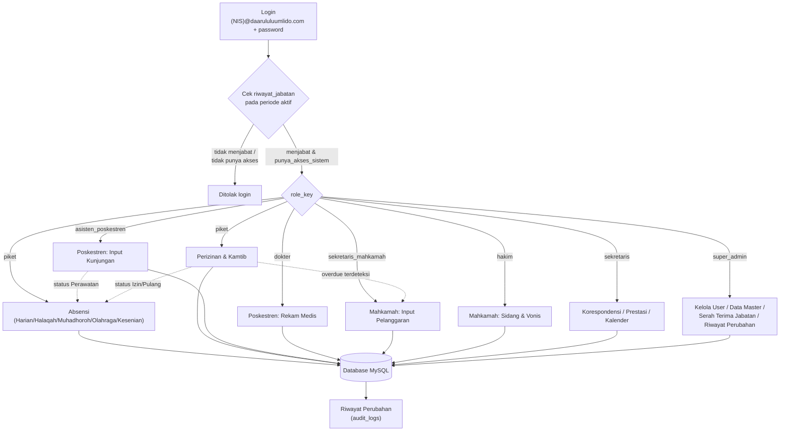

# Hisada — Sistem Informasi Manajemen Kesantrian

Sistem administrasi kesantrian untuk **Pondok Pesantren Daarul Uluum Lido**, dibangun dengan PHP native + MySQL/MariaDB, tanpa framework, tanpa build-tool JavaScript (semua aset front-end di-vendor lokal — tidak ada dependensi CDN eksternal).

## Fitur / Modul

| Modul | Fungsi Utama | Role |
|---|---|---|
| **Dashboard** | Statistik santri (L/P/total, sakit, pulang, alpha) + kegiatan mendatang | Semua user login |
| **Kalender Akademik** | Kalender 1 bulan / 2 bulan / 1 semester / 2 semester (tahun ajaran), anchor otomatis ke Jan/Jul, bisa dicetak | Semua (input: sekretaris/admin) |
| **Cari Santri / Cari Guru** | Live search (ketik langsung, tanpa tombol) | Semua user login |
| **Absensi** | Harian (basis kamar), Halaqah Qur'an, Muhadhoroh, Olahraga, Kesenian | Piket |
| **Poskestren** | Input kunjungan (rawat jalan/perawatan) + rekam medis + analisis tren musiman | Asisten Poskestren, Dokter |
| **Mahkamah Santri** | Input pelanggaran → antrean sidang → vonis / pemutihan (soft-delete) | Sekretaris Mahkamah, Hakim |
| **Perizinan & Kamtib** | Keluar Sementara (basis jam), Izin Dinas (tanggal+jam), Pulang (tanggal) — deteksi overdue otomatis, cetak surat izin | Piket |
| **Korespondensi** | Surat masuk & keluar (nomor surat input manual) | Sekretaris |
| **Prestasi Santri** | Pencatatan prestasi internal/eksternal | Sekretaris |
| **Data Master** | Kelola Kelas, Kamar, Keluarga, Guru, Santri — satuan maupun **import CSV massal** (upsert berdasar NIS/NIP) | Super Admin |
| **Kelola User** | Tambah/edit akun pengurus, reset password | Super Admin |
| **Serah Terima Jabatan** | Ganti masa khidmat (arsipkan periode lama, aktifkan periode baru) | Super Admin |
| **Riwayat Perubahan** | Audit log seluruh aksi, bisa difilter per masa jabatan | Super Admin |

## Flowchart Sistem



**Catatan alur penting:**
- Status absensi sebagian besar **terisi otomatis** lewat integrasi antar modul (Poskestren & Perizinan → Absensi), bukan diinput manual satu-satu.
- Perizinan yang **overdue** (lewat batas waktu tanpa konfirmasi kembali) otomatis masuk antrean Mahkamah.
- Hak akses (`role_key`) diambil dari `riwayat_jabatan` pada **periode jabatan yang sedang aktif** — begitu Serah Terima Jabatan dilakukan, hak akses seluruh pengurus lama otomatis nonaktif tanpa perlu diedit manual satu per satu.

## Instalasi (Hosting Shared / cPanel)

1. Upload seluruh isi folder ini ke `public_html` (atau subfolder) lewat cPanel File Manager.
2. Buka **cPanel → MySQL Databases**, buat database + user baru, lalu **Add User to Database** dengan centang **ALL PRIVILEGES**.
3. Buka **phpMyAdmin**, pilih database yang baru dibuat, import `database.sql` (file ini aman diimport ke database kosong maupun yang sudah pernah berisi data lama — otomatis `DROP TABLE` dulu).
4. Isi `config/database.php` dengan kredensial database (nama database & user **dengan prefix akun**, bukan nilai contoh).
5. Buka `reset_password.php` sekali lewat browser untuk memastikan password akun contoh (`hisada123`) valid, **lalu hapus file itu dari server**.
6. Login pakai salah satu akun contoh, misal `admin@daarululuumlido.com` / `hisada123`.

## Struktur Folder

```
├── index.php              # Halaman login
├── dashboard.php          # Seluruh modul (routing via ?modul=...)
├── logout.php
├── reset_password.php     # Utilitas sekali pakai, hapus setelah dipakai
├── database.sql           # Skema + data contoh (satu file, aman diimpor ulang)
├── config/
│   └── database.php       # Kredensial koneksi (isi sendiri, JANGAN commit yg asli)
├── includes/
│   ├── auth.php           # Session, login check, RBAC
│   ├── error_page.php      # Halaman error kustom (403/422/500) + exception handler
│   ├── header.php / sidebar.php / footer.php
│   └── print_surat_izin.php
└── assets/
    ├── css/style.css
    ├── img/                # logo & background login
    └── vendor/             # Bootstrap 5 + Bootstrap Icons (di-vendor lokal)
```

## Keamanan

- Password di-hash dengan **Bcrypt**.
- Semua query pakai **prepared statement** (PDO).
- Tidak ada dependensi ke domain eksternal mana pun (semua CSS/JS/font di-vendor lokal) — dirancang agar tidak terdeteksi sebagai pola phishing oleh alat keamanan seperti Cisco Umbrella.
- Exception tak terduga ditangani secara global — pengguna tidak pernah melihat stack trace PHP mentah.
