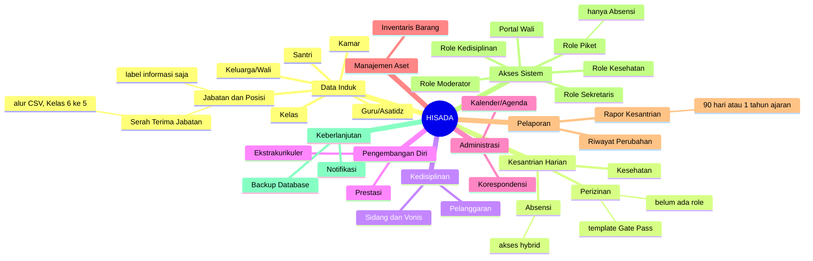
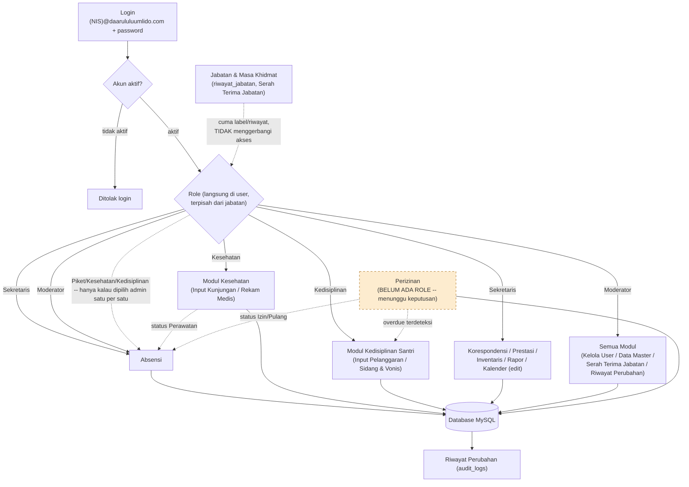
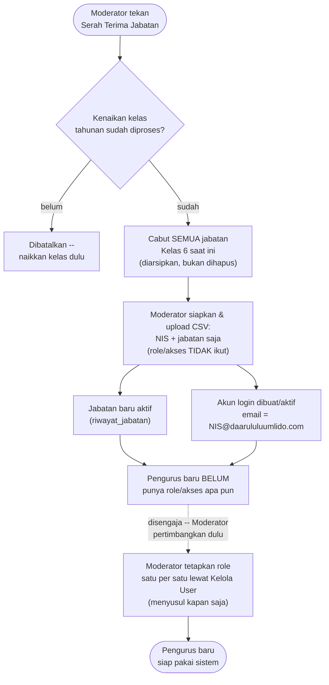

# Perkuat dari dasar (flowchart)
### Silahan revisi ulang flowchartnya
Abaikan jabatan, fokus kepada objek (sistem yang abadi tetap berjalan dan diperlukan dalam kegiatan HISADA)
### Ringkasan Singkat Alur
(Software Development Life Cycle (SDLC)) : Mindmap (Ide Besar) ➔ Analisis (Detail Fitur) ➔ Flowchart (Logika Jalannya Program) ➔ Desain Database (Penyimpanan Data) ➔ Coding (Pembuatan Program) ➔ Testing (Pengecekan Error) ➔ Deployment (Rilis Aplikasi).

# Sistem Hisada
### Himpunan Santri Daarul Uluum Lido — Sistem Informasi Manajemen Kesantrian

Dibangun dengan PHP native + MySQL/MariaDB, tanpa framework, tanpa build-tool JavaScript. Semua aset front-end (Bootstrap 5, Bootstrap Icons) di-vendor lokal — tidak ada dependensi ke CDN eksternal.

> **Status dokumen:** bagian Autentikasi, RBAC, Kesehatan, Kedisiplinan Santri, dan Flowchart di bawah ini sudah mencerminkan hasil ralat/desain ulang terbaru (role 5 kategori + model akses Absensi). **Kode PHP-nya sendiri BELUM diubah** — tahap ini masih Mindmap/Analisis/Flowchart, sesuai urutan SDLC di atas. Bagian lain yang tidak disinggung ralat tetap mendeskripsikan kode yang sudah berjalan.

---

## Mindmap (Ide Besar)

Mindmap ini mengelompokkan sistem berdasar **objek/domain yang permanen** — bukan jabatan (yang bisa berganti tiap Serah Terima Jabatan) — sesuai arahan di awal dokumen ini.


```mermaid
mindmap
  root((HISADA))
    Data Induk
      Santri
      Guru/Asatidz
      Kelas
      Kamar
      Keluarga/Wali
      Jabatan dan Posisi
        label informasi saja
        Serah Terima Jabatan
          alur CSV, Kelas 6 ke 5
    Kesantrian Harian
      Absensi
        akses hybrid
      Perizinan
        belum ada role
        template Gate Pass
      Kesehatan
    Kedisiplinan
      Pelanggaran
      Sidang dan Vonis
    Pengembangan Diri
      Prestasi
      Ekstrakurikuler
    Administrasi
      Korespondensi
      Kalender/Agenda
    Manajemen Aset
      Inventaris Barang
    Pelaporan
      Rapor Kesantrian
        90 hari atau 1 tahun ajaran
      Riwayat Perubahan
    Akses Sistem
      Role Piket
        hanya Absensi
      Role Kesehatan
      Role Kedisiplinan
      Role Sekretaris
      Role Moderator
      Portal Wali
    Keberlanjutan
      Backup Database
      Notifikasi
```

## Flowchart Sistem


```mermaid
flowchart TD
    A["Login<br/>(NIS)@daarululuumlido.com + password"] --> B{"Akun aktif?"}
    B -- "tidak aktif" --> Z["Ditolak login"]
    B -- "aktif" --> C{"Role (langsung di user,<br/>terpisah dari jabatan)"}

    C -- Kesehatan --> D3["Modul Kesehatan<br/>(Input Kunjungan / Rekam Medis)"]
    C -- Kedisiplinan --> D5["Modul Kedisiplinan Santri<br/>(Input Pelanggaran / Sidang & Vonis)"]
    C -- Sekretaris --> D7["Korespondensi / Prestasi /<br/>Inventaris / Rapor / Kalender (edit)"]
    C -- Moderator --> D8["Semua Modul<br/>(Kelola User / Data Master /<br/>Serah Terima Jabatan / Riwayat Perubahan)"]

    C -- Sekretaris --> D1["Absensi"]
    C -- Moderator --> D1
    C -. "Piket/Kesehatan/Kedisiplinan -- hanya kalau dipilih admin satu per satu" .-> D1

    D9["Perizinan<br/>(BELUM ADA ROLE -- menunggu keputusan)"]

    D1 --> E[("Database MySQL")]
    D3 --> E
    D5 --> E
    D7 --> E
    D8 --> E
    D9 --> E

    D9 -. "overdue terdeteksi" .-> D5
    D3 -. "status Perawatan" .-> D1
    D9 -. "status Izin/Pulang" .-> D1
    E --> F["Riwayat Perubahan (audit_logs)"]

    J["Jabatan & Masa Khidmat<br/>(riwayat_jabatan, Serah Terima Jabatan)"] -. "cuma label/riwayat,<br/>TIDAK menggerbangi akses" .-> C

    style D9 fill:#fdeccf,stroke:#a5680f,stroke-dasharray: 5 5
```

---

## 1. Autentikasi & RBAC

- Login pakai **email `(NIS)@daarululuumlido.com` + password**, bukan NIS polos.
- **Role sekarang field tersendiri, terpisah dari jabatan** — 5 kategori, lebih luas cakupannya dibanding role lama yang terlalu sempit (dulu: piket, asisten_poskestren, dokter, sekretaris_mahkamah, hakim, sekretaris):

  | Role | Cakupan modul |
  |---|---|
  | **Piket** | Absensi saja (lihat aturan khusus di bawah — tidak otomatis, perlu dipilih admin) |
  | **Kesehatan** | Modul Kesehatan (gabungan eks Asisten Poskestren + Dokter) |
  | **Kedisiplinan** | Modul Kedisiplinan Santri (gabungan eks Sekretaris Mahkamah + Hakim) |
  | **Sekretaris** | Korespondensi, Prestasi, Inventaris, Rapor Kesantrian, Kalender (edit), **+ Absensi penuh otomatis** |
  | **Moderator** | Seluruh modul tanpa kecuali (dulu disebut Super Admin) |

- **Absensi** aturan khusus (bukan murni ikut role): **Sekretaris** dan **Moderator** otomatis dapat akses penuh; role lain (**Piket, Kesehatan, Kedisiplinan**) baru dapat akses kalau orangnya **dipilih manual satu per satu oleh admin** — bukan otomatis dari role-nya.
- **Jabatan (judul teks bebas, mis. "Sekretaris Mahkamah") dan Masa Khidmat (`riwayat_jabatan`, `periode_jabatan`, Serah Terima Jabatan) kini terpisah total dari akses** — murni label/riwayat organisasi. Serah Terima Jabatan **tidak lagi otomatis mengubah hak akses siapa pun** (beda dari perilaku lama).
- Password di-hash **Bcrypt**.
- Error tak terduga ditangani lewat *global exception handler* — halaman error kustom (403/422/500) konsisten dengan desain aplikasi.

## 2. Dashboard

- Statistik satu baris: jumlah santri **laki-laki / perempuan / total**.
- Statistik tambahan: sakit (30 hari terakhir), status pulang hari ini, alpha hari ini.
- Daftar kegiatan mendatang dari Kalender Akademik.

## 3. Modul Absensi

- Kartu pilihan: **Harian (Kamar)**, Halaqah Qur'an, Muhadhoroh, Olahraga, Kesenian.
- **Absensi Harian**: satu dropdown Kamar (label "Gedung - Kamar"), submit otomatis begitu kamar/tanggal dipilih.
- **Absensi kegiatan lain**: berbasis keanggotaan grup (ekskul untuk Olahraga/Kesenian, grup kegiatan untuk Halaqah/Muhadhoroh).
- Status absensi harian sebagian besar **terisi otomatis** dari modul lain (Kesehatan → Sakit, Perizinan → Izin/Pulang/Alpha).
- **Akses**: lihat §1 — Sekretaris & Moderator otomatis, role lain perlu dipilih admin satu per satu.

## 4. Modul Kesehatan

*(sebelumnya "Poskestren", digabung dari dua modul terpisah Asisten + Dokter jadi satu modul dengan tombol pemisah tampilan — pola sama seperti Korespondensi Surat Masuk/Keluar)*

- **Input Kunjungan**: dua jenis — **Rawat Jalan** (konsultasi saja, tidak mengubah status absensi) dan **Perawatan** (status absensi hari itu otomatis jadi "Sakit").
- **Rekam Medis**: antrean pemeriksaan + pengisian diagnosa/resep/tindak lanjut.
- Status "Sakit" hanya berlaku untuk tanggal itu saja — otomatis kembali "Hadir" esoknya kecuali diisi ulang.
- Analisis musim sakit: tren kunjungan 6 bulan terakhir + keluhan terbanyak.
- **Akses**: role Kesehatan (otomatis dapat dua-duanya, Input Kunjungan maupun Rekam Medis — tidak lagi dipisah per orang seperti dulu).

## 5. Modul Kedisiplinan Santri

*(sebelumnya "Mahkamah Santri", digabung dari Sekretaris Mahkamah + Hakim jadi satu modul dengan tombol pemisah tampilan)*

- **Input Pelanggaran**: kategori, keterangan, santri → masuk antrean sidang.
- **Sidang & Vonis**: memvonis **Ringan/Sedang/Berat**, atau melakukan **pemutihan** (soft-delete + alasan pembatalan, bukan hapus permanen — audit trail tetap ada).
- **Akses**: role Kedisiplinan (otomatis dapat dua-duanya).

## 6. Modul Perizinan

> **⚠️ Belum ada role yang memegang modul ini.** Piket (sebelumnya disebut Pengurus) sempat direncanakan untuk ini, lalu dibatalkan — Piket sekarang **hanya** pegang Absensi (lihat §1 dan §3). Sekretaris juga sempat direncanakan pegang ini, lalu dibatalkan lagi. **Menunggu instruksi lanjutan** siapa yang akan memegang Perizinan.

Tiga jenis izin, masing-masing basis waktu berbeda (Keluar Sementara dikonfirmasi tetap seperti sekarang — mulai otomatis, tidak dibuat bisa dipilih):

| Jenis | Basis Waktu | Catatan |
|---|---|---|
| **Keluar Sementara** | Jam (hari ini) | Mulai otomatis dari jam saat input, sampai jam yang ditentukan (mis. 16:00) |
| **Izin Dinas** | Tanggal + Jam | Bisa lintas hari (mis. berangkat besok pagi, pulang lusa sore) |
| **Pulang** | Tanggal saja | Rentang tanggal seperti biasa |

- Deteksi **overdue otomatis** → status jadi Overdue, absensi jadi Alpha, otomatis masuk antrean **Kedisiplinan Santri** kategori Keamanan.
- Konfirmasi kembali untuk menutup izin yang sudah selesai.

**Cetak surat izin** — mengikuti template "Official Gate Pass" (dokumen: *Template Perizinan*, pemilik `jaohongk@gmail.com`), satu desain dipakai untuk ketiga jenis izin:

- Field: Name, Class, Room, Reason, Departure Time, Return Time, kolom tanda tangan Security Department & Dormitory Guardian.
- **Name/Class/Room** diisi otomatis dari data santri. **Reason** = field keterangan yang sudah ada.
- **Label "Departure Time"/"Return Time" sama persis untuk ketiga jenis izin** — yang berbeda cuma format isinya, menyesuaikan basis waktu tiap jenis:

  | Jenis | Isi "Departure Time" / "Return Time" |
  |---|---|
  | Keluar Sementara | Jam saja (mis. "14:30") |
  | Izin Dinas | Tanggal + jam (mis. "15 Okt 2026, 08:00") |
  | Pulang | Tanggal saja (mis. "15 Okt 2026") |

## 7. Modul Korespondensi

*(akses: role Sekretaris)*

- **Surat keluar: nomor diketik manual** oleh sekretaris (bukan lagi digenerate otomatis).
- Surat masuk: nomor manual + status disposisi.
- Validasi regex lampiran: hanya menerima URL Google Docs resmi.

## 8. Modul Prestasi Santri

*(akses: role Sekretaris)*

- Input: santri, nama kegiatan, lokasi, tingkat (internal/eksternal), keterangan, tanggal.

## 9. Modul Kalender Akademik

- Empat mode tampilan: **1 Bulan, 2 Bulan, 1 Semester, 2 Semester** (anchor otomatis ke batas Januari/Juli).
- Klik tanggal kosong → popup tambah agenda, kategori **Umum/Akademik/Pengasuhan**, minimal satu kategori wajib dipilih (validasi server-side).
- Bisa **dicetak** langsung dari browser.
- Hanya **Sekretaris dan Moderator** yang bisa menambah/mengubah agenda; role lain read-only.

## 10. Kelola User

*(akses: Moderator)*

- Edit data user (nama, email, status, reset password).
- **Tambah User Baru** — sekarang dua langkah yang terpisah secara konsep: (a) angkat santri jadi pengurus + catat jabatan (opsional, murni label), (b) **tetapkan role** (salah satu dari 5 kategori) yang menentukan akses sesungguhnya. Untuk Absensi, ada langkah tambahan khusus: centang manual kalau role-nya bukan Sekretaris/Moderator.

## 11. Masa Jabatan / Khidmat (bukan tahun ajaran)

- `periode_jabatan`: menyimpan periode dengan status `aktif`/`arsip` — data periode lama tidak pernah dihapus, cuma diarsipkan.
- `riwayat_jabatan`: penghubung santri ↔ periode ↔ posisi (jabatan, teks bebas). **Tidak lagi menyimpan role/hak akses** — itu sekarang field terpisah, langsung di akun user, tidak terikat periode jabatan.

## 12. Serah Terima Jabatan

*(akses: hanya Moderator — tidak ada pengecualian)*

- **Jabatan pengurus dibatasi Kelas 5 dan Kelas 6 saja** — kelas 4 ke bawah tidak pernah menjabat. Karena kenaikan kelas terjadi tiap tahun, siapa pun yang mulai menjabat dari Kelas 5 otomatis sudah jadi Kelas 6 di gilirannya nanti — alurnya selalu **Kelas 6 (keluar) → Kelas 5 (masuk)**, konsisten tiap tahun.
- **Prasyarat urutan proses**: kenaikan kelas tahunan santri harus sudah diproses lebih dulu, baru Serah Terima Jabatan dijalankan. Kalau terbalik, sistem masih melihat kelas lama (belum naik), jadi validasi "Kelas 6" bisa salah.
- Tombol "Serah Terima Jabatan" ditekan Moderator → **seluruh pengurus Kelas 6 saat ini dicabut jabatannya sekaligus** (diarsipkan ke riwayat — **bukan dihapus**, tetap bisa dilihat di Riwayat Perubahan/riwayat organisasi).
- Moderator menyiapkan **CSV pengganti**: NIS + jabatan (teks bebas, mis. "Sekretaris Mahkamah") untuk setiap posisi yang perlu diisi dari Kelas 5. **Role/hak akses sengaja TIDAK ikut di CSV ini** — murni soal jabatan organisasi.
- Begitu CSV diproses: jabatan baru langsung aktif + akun login dibuat otomatis (email dari NIS + `@daarululuumlido.com`, pola yang sama seperti Tambah User biasa).
- **Jeda yang disengaja**: pengurus baru hasil CSV ini belum punya role/akses apa pun sampai Moderator menetapkannya manual satu per satu lewat Kelola User, menyusul kapan saja setelahnya — bukan bug, ini waktu yang disengaja untuk Moderator mempertimbangkan pembagian modul yang pas untuk tiap orang, bukan asal isi buru-buru.

**Alur lengkap:**


```mermaid
flowchart TD
    Start(["Moderator tekan<br/>Serah Terima Jabatan"]) --> Check{"Kenaikan kelas<br/>tahunan sudah diproses?"}
    Check -- "belum" --> Stop["Dibatalkan --<br/>naikkan kelas dulu"]
    Check -- "sudah" --> Cabut["Cabut SEMUA jabatan<br/>Kelas 6 saat ini<br/>(diarsipkan, bukan dihapus)"]
    Cabut --> CSV["Moderator siapkan & upload CSV:<br/>NIS + jabatan saja<br/>(role/akses TIDAK ikut)"]
    CSV --> Jabatan["Jabatan baru aktif<br/>(riwayat_jabatan)"]
    CSV --> Akun["Akun login dibuat/aktif<br/>email = NIS@daarululuumlido.com"]
    Jabatan --> Jeda["Pengurus baru BELUM<br/>punya role/akses apa pun"]
    Akun --> Jeda
    Jeda -. "disengaja -- Moderator<br/>pertimbangkan dulu" .-> Role["Moderator tetapkan role<br/>satu per satu lewat Kelola User<br/>(menyusul kapan saja)"]
    Role --> Aktif(["Pengurus baru<br/>siap pakai sistem"])
```

## 13. Ekstrakurikuler

- `kategori_ekskul` (Olahraga, Kesenian) → `ekstrakurikuler` (banyak cabang per kategori) → `ekskul_anggota` (keanggotaan dengan histori keluar-masuk).
- Pelatih **bukan entitas terpisah** — cukup FK ke tabel guru/asatidz yang sudah ada.

## 14. Basis Kamar (bukan Kelas)

- `kamar_id` jadi filter utama di seluruh modul operasional (absensi, dsb).
- `kelas_id` tetap ada sebagai referensi, bukan filter utama.

## 15. Cari Santri & Cari Guru

- Dua modul terpisah, masing-masing **live search** — hasil terfilter otomatis saat mengetik, tanpa tombol/reload.
- Cari Santri punya filter tambahan berdasar kamar.

## 16. Data Master

*(akses: Moderator)*

- Kelola **Kelas, Kamar, Keluarga, Guru, Santri** — satuan (form manual) maupun **massal (import CSV)**.
- Import CSV bersifat **upsert**: NIS/NIP yang sudah ada otomatis diperbarui, bukan dobel.

## 17. Riwayat Perubahan (History)

*(akses: Moderator)*

- Menampilkan `audit_logs` yang sudah tercatat otomatis dari seluruh modul sejak awal.
- Bisa difilter **per masa jabatan** — tetap relevan karena masa jabatan masih dipertahankan sbg riwayat organisasi.

## 18. Komponen Pencarian Santri (Typeahead)

- Komponen reusable: ketik nama/NIS, klik hasil yang mendekati — menggantikan dropdown panjang di berbagai form.

## 19. Riwayat Mutasi Kamar & Profil Kesehatan Tetap

- Bagian dari Data Master (Edit Santri). Pindah kamar tidak menimpa data lama — riwayat lama otomatis diarsipkan.
- Profil kesehatan (golongan darah, alergi, penyakit kronis) tersimpan permanen per santri.
- Perubahan status santri ke Alumni/Keluar otomatis menonaktifkan akun login santri tsb.

## 20. Inventaris Barang

*(akses: role Sekretaris)*

- Berbasis **kode barang → banyak unit fisik**: satu kode bisa mewakili beberapa unit, masing-masing punya kategori (lama/baru) dan tingkat kondisi sendiri.

## 21. Rapor Kesantrian

*(akses: role Sekretaris)*

- Laporan gabungan per santri: rekap kehadiran, catatan pelanggaran, prestasi, dan ekskul aktif — bisa dicetak.
- Dua pilihan rentang: **90 Hari Terakhir** (default) atau **1 Tahun Ajaran** (mengikuti pola tahun ajaran sekolah Indonesia pada umumnya, **Juli–Juni** — konsisten dengan logika anchor yang sudah dipakai di Kalender Akademik §9, bukan Januari–Desember).

## 22. Notifikasi

- Polling ringan di sidebar (cek tiap 30 detik) — badge muncul kalau ada pelanggaran menunggu sidang (role **Kedisiplinan**), santri menunggu diperiksa (role **Kesehatan**), atau perizinan overdue (*role penerima notifikasi ini masih menggantung, mengikuti §6 — belum ditentukan siapa yang pegang Perizinan*).

## 23. Backup Database

*(akses: Moderator)*

- **Backup Manual (.sql)** — dump seluruh database, siap diunduh & diimpor ulang.
- **Backup CSV (.zip)** — 8 tabel terpenting sebagai file `.csv` terpisah. Pengganti integrasi Google Sheets yang gagal dicoba (Google Apps Script tidak konsisten menjaga method+body POST saat redirect, baik dari server maupun browser).

## 24. Portal Wali Santri

- Login terpisah (`wali.php`) berbasis keluarga. Satu akun bisa melihat semua anak dalam satu keluarga (read-only).
- Akun dibuat lewat Data Master → tab Keluarga.

## 25. Export Excel

- File `.xlsx` asli dibuat native pakai `ZipArchive` bawaan PHP, tanpa Composer/PhpSpreadsheet. Tersedia di Prestasi, Korespondensi, dan rekap Absensi Kamar.

---

## Belum Diimplementasikan (masih rencana, bukan fitur aktif)

- **Sistem role & akses baru (5 kategori + model hybrid Absensi)** — sudah final di tahap desain (lihat §1 dan Flowchart di atas), **belum dikoding**. Kode PHP saat ini masih pakai role_key lama (piket/asisten_poskestren/dokter/sekretaris_mahkamah/hakim/sekretaris) yang terikat `riwayat_jabatan`.
- Penggabungan modul Poskestren→Kesehatan dan Mahkamah→Kedisiplinan Santri — juga baru di tahap desain, kode masih dua modul terpisah untuk masing-masing.
- Export laporan ke **PDF** — butuh library rendering yang tidak tersedia tanpa Composer.
- Backup **otomatis terjadwal** (cron job) — saat ini backup masih manual.
- CSV import untuk Kelas/Kamar/Keluarga belum ada validasi duplikat sekuat Santri/Guru.

---

## Instalasi (Hosting Shared / cPanel)

1. Upload seluruh isi folder ini ke `public_html` lewat cPanel File Manager.
2. **cPanel → MySQL Databases** → buat database + user baru → **Add User to Database** dengan **ALL PRIVILEGES**.
3. **phpMyAdmin** → pilih database yang baru dibuat → import `database.sql`.
4. Isi `config/database.php` dengan kredensial asli.
5. Buka `reset_password.php` sekali lewat browser, **lalu hapus file itu dari server**.
6. Login: `admin@daarululuumlido.com` / `hisada123`.

## Struktur Folder

```
├── index.php              # Halaman login
├── dashboard.php          # Seluruh modul (routing via ?modul=...)
├── logout.php
├── reset_password.php     # Utilitas sekali pakai
├── database.sql           # Skema + data contoh (satu file)
├── config/database.php    # Kredensial koneksi (isi sendiri)
├── includes/
│   ├── auth.php               # Session, login check, RBAC
│   ├── error_page.php          # Halaman error kustom + exception handler
│   ├── print_surat_izin.php
│   └── header.php / sidebar.php / footer.php
└── assets/                # CSS, logo, Bootstrap (di-vendor lokal)
```
