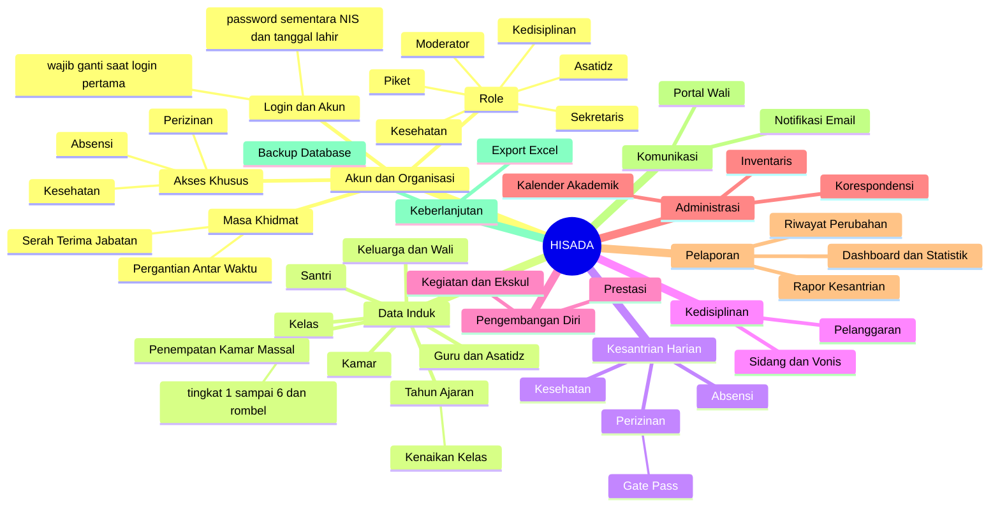
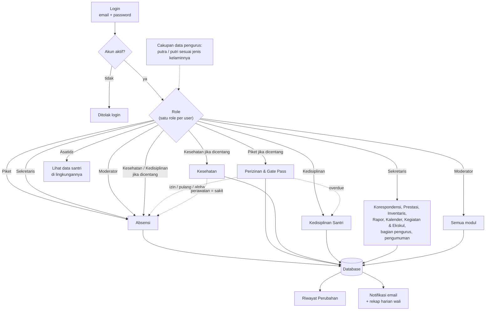
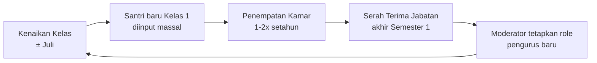
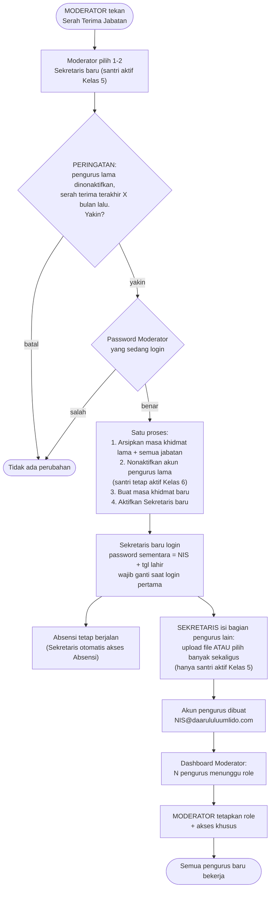
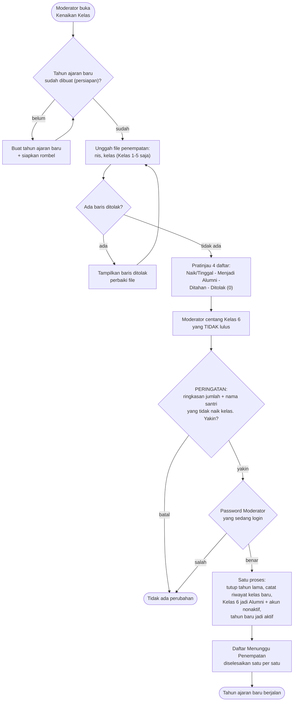
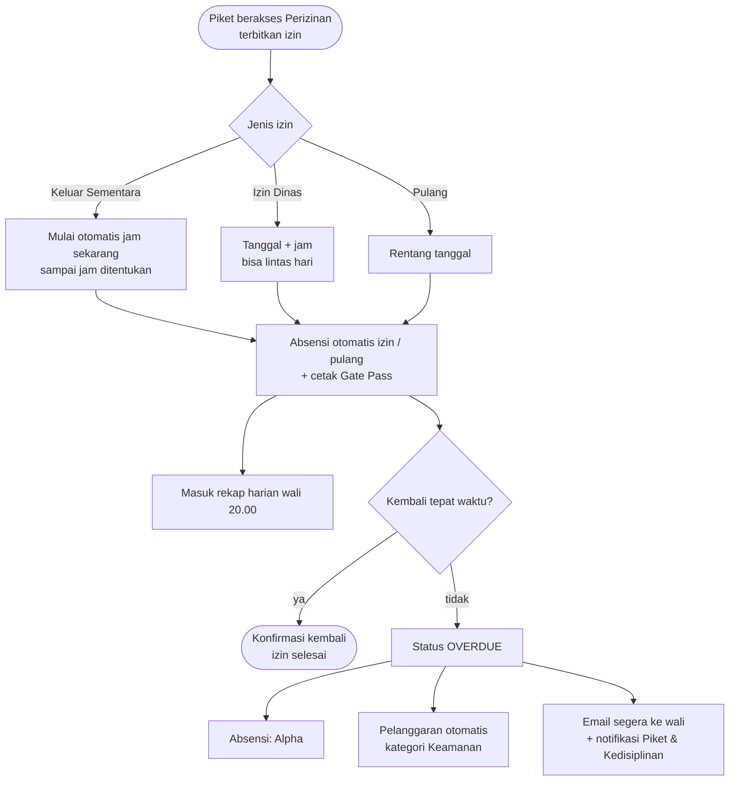
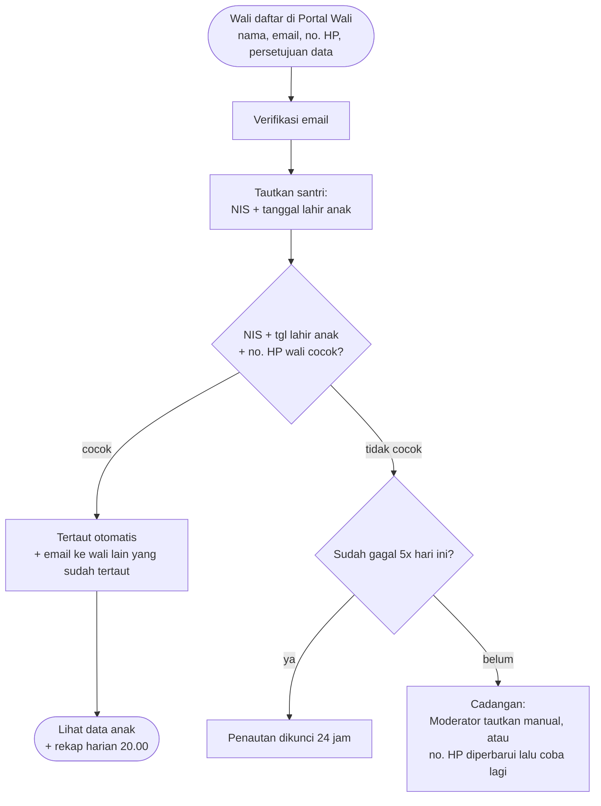

# Perkuat dari dasar (flowchart)
### Silahan revisi ulang flowchartnya
Abaikan jabatan, fokus kepada objek (sistem yang abadi tetap berjalan dan diperlukan dalam kegiatan HISADA)
### Ringkasan Singkat Alur
(Software Development Life Cycle (SDLC)) : Mindmap (Ide Besar) ➔ Analisis (Detail Fitur) ➔ Flowchart (Logika Jalannya Program) ➔ Desain Database (Penyimpanan Data) ➔ Coding (Pembuatan Program) ➔ Testing (Pengecekan Error) ➔ Deployment (Rilis Aplikasi).

# Sistem Hisada
### Himpunan Santri Daarul Uluum Lido — Sistem Informasi Manajemen Kesantrian

Dibangun dengan PHP native + MySQL/MariaDB, tanpa framework, tanpa build-tool JavaScript. Semua aset front-end (Bootstrap 5, Bootstrap Icons) di-vendor lokal — tidak ada dependensi ke CDN eksternal.

> **Status dokumen (4 Oktober 2026):** dokumen ini berisi **hasil desain sistem** (Mindmap, Analisis, Flowchart) yang sudah disepakati. **Kode PHP belum diubah** mengikuti desain ini — kode yang berjalan saat ini masih versi lama (lihat [Status Implementasi](#status-implementasi)). Hal yang belum diputuskan dikumpulkan di [Belum Diputuskan](#belum-diputuskan).

---

## Daftar Isi

- [Posisi Tahap SDLC](#posisi-tahap-sdlc)
- [Lingkungan Pondok](#lingkungan-pondok)
- [Mindmap (Ide Besar)](#mindmap-ide-besar)
- [Flowchart Sistem](#flowchart-sistem)
- [Role, Akses Khusus & Cakupan Data](#role-akses-khusus--cakupan-data)
- [Siklus Tahunan](#siklus-tahunan)
- **Modul**
  - A. Akun & Organisasi — [1. Login & Akun](#1-login--akun) · [2. Kelola User & Role](#2-kelola-user--role) · [3. Masa Khidmat & Serah Terima Jabatan](#3-masa-khidmat--serah-terima-jabatan) · [4. Pergantian Antar-Waktu (PAW)](#4-pergantian-antar-waktu-paw)
  - B. Data Induk — [5. Data Master](#5-data-master) · [6. Tahun Ajaran & Kenaikan Kelas](#6-tahun-ajaran--kenaikan-kelas) · [7. Penempatan Kamar Massal](#7-penempatan-kamar-massal) · [8. Ubah Massal & Import](#8-ubah-massal--import) · [9. Cari Santri & Cari Guru](#9-cari-santri--cari-guru)
  - C. Kesantrian Harian — [10. Absensi](#10-absensi) · [11. Perizinan](#11-perizinan) · [12. Kesehatan](#12-kesehatan)
  - D. Kedisiplinan — [13. Kedisiplinan Santri](#13-kedisiplinan-santri)
  - E. Pengembangan Diri — [14. Prestasi Santri](#14-prestasi-santri) · [15. Kegiatan & Ekskul](#15-kegiatan--ekskul)
  - F. Administrasi — [16. Korespondensi](#16-korespondensi) · [17. Kalender Akademik](#17-kalender-akademik) · [18. Inventaris Barang](#18-inventaris-barang)
  - G. Pelaporan — [19. Dashboard & Statistik](#19-dashboard--statistik) · [20. Rapor Kesantrian](#20-rapor-kesantrian) · [21. Riwayat Perubahan](#21-riwayat-perubahan)
  - H. Komunikasi — [22. Notifikasi](#22-notifikasi) · [23. Portal Wali Santri](#23-portal-wali-santri)
  - I. Keberlanjutan — [24. Backup Database](#24-backup-database) · [25. Export Excel](#25-export-excel)
- [Belum Diputuskan](#belum-diputuskan)
- [Status Implementasi](#status-implementasi)
- [Instalasi](#instalasi-kode-saat-ini)
- [Struktur Folder](#struktur-folder)

---

## Posisi Tahap SDLC

| Tahap | Status |
|---|---|
| Mindmap | ✅ Selesai |
| Analisis | ✅ Sebagian besar selesai (sisa: lihat [Belum Diputuskan](#belum-diputuskan)) |
| Flowchart | ✅ Selesai untuk alur utama |
| Desain Database | ⏳ Berikutnya |
| Coding · Testing · Deployment | ⬜ Belum dimulai |

---

## Lingkungan Pondok

> Hasil brainstorming **lingkungan nyata** pondok (8 Oktober 2026): siapa saja pelakunya, unit apa saja yang ada, kegiatan apa yang berjalan, dan siapa yang mencatat apa. Bagian ini menjadi **dasar** desain sistem; bagian yang belum sejalan dengan desain di bawah dikumpulkan di [Belum Diputuskan](#belum-diputuskan).

### Pelaku

| Pelaku | Keterangan |
|---|---|
| **Santri** | Peserta semua kegiatan dan yang dinilai. Tidak punya akses sistem. |
| **Pengurus** | Santri juga: tetap tinggal di kamar, ikut kelas, dan **tetap dinilai** di beberapa kegiatan. Bekerja per **bagian** (Perbadatan, Bahasa, Keamanan, Dapur, dst.); bagian adalah pembagian kerja, **bukan** patokan role. |
| **Guru** | Lazim memegang **banyak peran sekaligus** tanpa batasan: wali kamar, wali kelas, pengajar, guru tahsin, pelatih, pengontrol kegiatan, guru pengasuhan, hakim. |
| **Lembaga guru** | BPPS, BPK-TMI, BPPK, Mabikori (Pramuka), Bidang Pengajaran TMI, Bidang Pembinaan & Pengasuhan. Khusus guru, bagian dari pesantren. |
| **Dokter** | Datang pada jadwal tertentu atau saat darurat. |

Seluruh lingkungan **dipisah putra dan putri**.

### Unit & kelompok

| Unit | Anggota | Penyusun anggota |
|---|---|---|
| **Rayon** (asrama) → kamar | Santri + guru wali kamar | Pengurus |
| **Kelas** (1A, 1B, …) | Santri + wali kelas + pengajar materi | Pengurus |
| **Kelompok tahsin** | Santri + pengurus + guru pengoreksi | Pengurus |
| **Kelompok muhadhoroh** | Santri + pengurus pengatur + guru pengontrol | Pengurus |
| **Ekskul** | Santri + guru pelatih | Pengurus |
| **Pramuka**: DLT 1, 2, … → sub-kelompok | Santri + pengurus pembimbing + guru pengontrol | Pengurus |
| **Marhalah** | Pengelompokan fleksibel (per kelas, per grup, dll.) | — |

- Perubahan anggota bersifat **insidentil**, mengikuti ketentuan masing-masing bagian.
- Santri yang pindah kelompok membawa **catatan/nilainya**, lalu berlanjut di kelompok baru.

### Kegiatan & absensi

| Kegiatan | Waktu | Diabsen oleh |
|---|---|---|
| Shalat berjamaah (5 waktu) | — | Tidak diabsen |
| Tasywidul mufrodat / muhadatsah | Ba'da subuh | Pengurus |
| KBM (pagi & siang) | Pagi & siang | Guru |
| Kegiatan sore / ekskul | Sore | Guru |
| Halaqoh tadarus (tahsin), per kelompok | Ba'da maghrib | Guru |
| Belajar malam, di kelas | Ba'da isya | Wali kelas |
| Muhadhoroh | Senin malam & Jumat siang | Pengurus |
| Pramuka | Sabtu siang | Pengurus |
| Absensi malam / harian | Sebelum tidur | Wali kamar atau pengurus, bergantian |

- Santri yang melewatkan kegiatan karena sakit dicatat **tidak hadir**.
- Keaktifan ekskul **disatukan dengan absensi**.

### Penilaian

| Bidang | Yang dinilai |
|---|---|
| **Ekskul** | Prestasi lomba + keaktifan (absensi) |
| **Syakia** | Setoran surat/doa yang ditentukan **per kelas**; setoran fleksibel, **wajib 2 jenis per semester** |
| **Tahsin** | Bacaan dari halaman sampai halaman, dan jumlah khatam (dicatat guru) |
| **Muhadhoroh** | Bahasa (Indonesia, Arab, Inggris) + kelancaran; tampil bergiliran per grup |
| **Pramuka** | Keaktifan menyetor SKU & SKK |

### Mahkamah

- **Santri:** pengurus mengajukan tuntutan → guru **hakim** menimbang dan menentukan hukuman.
- **Pengurus:** pelanggarannya dicatat oleh **guru pengasuhan** yang memiliki hak menginput pelanggaran.
- **Pembatalan:** setiap penginput dapat membatalkan inputnya dalam **1 jam**. Setelah santri dihukum, **pemutihan hanya oleh hakim**.
- Setiap malam ba'da isya, **Bagian Bahasa membacakan nama** seluruh pelanggar hari itu berdasarkan data hakim. Ini bukan mahkamah tersendiri.

### Layanan santri

- **Kesehatan:** santri sakit dibawa ke pusat kesehatan → didata pengurus jaga → diperiksa dokter (diagnosa + resep).
- **Makan:** sesuai menu harian. Santri yang tidak bisa makan menu biasa melapor ke dapur pusat, atau dibelikan oleh guru/pengurus.

### Perizinan

- **Bagian Keamanan** memegang seluruh perizinan: menerima pengajuan, mengizinkan, mencetak dan menandatangani Gate Pass, serta mencatat jam keluar dan jam kembali. Guru pengasuhan dan pihak terkait **hanya menerima notifikasi**.
- **Izin keluar** (beberapa jam) dan **izin pulang** (beberapa hari). Izin pulang **wajib didampingi wali santri**. Libur pondok bersifat massal, mengikuti kalender HISADA.
- **Terlambat kembali:** tanpa masa tenggang; kegiatan yang terlewat dicatat tidak hadir; keterlambatan **masuk mahkamah**; wali santri **segera diberi tahu**.

### Wali santri

- Santri **tidak boleh membawa HP**; komunikasi wali ↔ santri lewat **wali asuh** (perannya seperti wali santri / wali kelas).
- Titik kontak wali ke pondok: **wali kamar** dan **wali kelas**.
- Wali diberi tahu **per kejadian** (santri sakit, divonis hukuman berat, terlambat kembali, dll.), bukan rekap harian.
- **Kunjungan** waktunya tidak menentu, tetapi tetap dicatat.
- **Kiriman** uang/barang disimpan di tempat penitipan yang dijaga pengurus keamanan, dan dicatat.

### Jadwal harian

Mengacu pada *Jadwal Kegiatan Harian Santri* dalam Risalah HISADA 2025/2026, dengan perubahan terbaru. Jadwal disesuaikan bila ketetapan baru terbit.

| Jam | Senin–Sabtu | Variasi |
|---|---|---|
| 04.00–05.20 | Bangun, subuh berjamaah, wirid | Jumat Al-Kahfi |
| 05.20–05.45 | Tasywidul mufrodat | Rabu & Ahad muhadatsah |
| 05.45–07.00 | Mandi, sarapan, persiapan & bel masuk KBM | Ahad olahraga |
| 07.10–12.00 | KBM | Jumat s.d. 10.40; Ahad kerja bakti & latihan ekskul |
| 12.00–13.40 | Dzuhur, istirahat, makan siang | |
| 13.40–15.00 | KBM siang | Jumat muhadhoroh; Sabtu Pramuka; Ahad istirahat |
| 15.00–16.00 | Ashar, wirid, maklumat Bagian Bahasa | |
| 16.00–17.00 | Kegiatan sore / ekskul | |
| 17.00–18.30 | Mandi, makan malam, maghrib | |
| 18.30–19.15 | Halaqoh tadarus per kelompok | Kamis tahlil & yasinan; Ahad maulid |
| 19.15–19.45 | Isya, pembacaan nama pelanggar | |
| 19.45–21.00 | Belajar malam di kelas | Senin muhadhoroh; Kamis & Sabtu kajian kitab per marhalah |
| 21.00–22.00 | Muraja'ah mufrodat, tadarus qobla naum, absensi malam | |
| 22.00–04.00 | Wajib tidur | |

Kegiatan mingguan, semesteran, dan tahunan cukup dicatat di [Kalender Akademik](#17-kalender-akademik).

---

## Mindmap (Ide Besar)

Sistem dikelompokkan berdasarkan **objek/proses yang permanen**, bukan jabatan (jabatan berganti setiap Serah Terima).


```mermaid
mindmap
  root((HISADA))
    Akun dan Organisasi
      Login dan Akun
        password sementara NIS dan tanggal lahir
        wajib ganti saat login pertama
      Role
        Piket
        Kesehatan
        Kedisiplinan
        Sekretaris
        Asatidz
        Moderator
      Akses Khusus
        Absensi
        Kesehatan
        Perizinan
      Masa Khidmat
        Serah Terima Jabatan
        Pergantian Antar Waktu
    Data Induk
      Santri
      Guru dan Asatidz
      Kelas
        tingkat 1 sampai 6 dan rombel
      Kamar
      Keluarga dan Wali
      Tahun Ajaran
        Kenaikan Kelas
      Penempatan Kamar Massal
    Kesantrian Harian
      Absensi
      Perizinan
        Gate Pass
      Kesehatan
    Kedisiplinan
      Pelanggaran
      Sidang dan Vonis
    Pengembangan Diri
      Prestasi
      Kegiatan dan Ekskul
    Administrasi
      Korespondensi
      Kalender Akademik
      Inventaris
    Pelaporan
      Dashboard dan Statistik
      Rapor Kesantrian
      Riwayat Perubahan
    Komunikasi
      Notifikasi Email
      Portal Wali
    Keberlanjutan
      Backup Database
      Export Excel
```

---

## Flowchart Sistem

Alur dari login sampai modul yang bisa dibuka.


```mermaid
flowchart TD
    A["Login<br/>email + password"] --> B{"Akun aktif?"}
    B -- "tidak" --> Z["Ditolak login"]
    B -- "ya" --> C{"Role<br/>(satu role per user)"}

    C -- "Piket" --> M1["Absensi"]
    C -- "Sekretaris" --> M1
    C -- "Moderator" --> M1
    C -- "Kesehatan / Kedisiplinan<br/>jika dicentang" --> M1

    C -- "Piket jika dicentang" --> M2["Perizinan & Gate Pass"]
    C -- "Kesehatan jika dicentang" --> M3["Kesehatan"]
    C -- "Kedisiplinan" --> M4["Kedisiplinan Santri"]
    C -- "Sekretaris" --> M5["Korespondensi, Prestasi, Inventaris,<br/>Rapor, Kalender, Kegiatan & Ekskul,<br/>bagian pengurus, pengumuman"]
    C -- "Asatidz" --> M6["Lihat data santri<br/>di lingkungannya"]
    C -- "Moderator" --> M7["Semua modul"]

    S["Cakupan data pengurus:<br/>putra / putri sesuai jenis kelaminnya"] -.-> C

    M2 -. "overdue" .-> M4
    M2 -. "izin / pulang / alpha" .-> M1
    M3 -. "perawatan = sakit" .-> M1

    M1 --> DB[("Database")]
    M2 --> DB
    M3 --> DB
    M4 --> DB
    M5 --> DB
    M7 --> DB
    DB --> L["Riwayat Perubahan"]
    DB --> N["Notifikasi email<br/>+ rekap harian wali"]
```

---

## Role, Akses Khusus & Cakupan Data

### Role (satu role per user)

| Role | Pemegang | Modul |
|---|---|---|
| **Piket** | Pengurus santri | Absensi (otomatis) · Perizinan & Gate Pass (jika dicentang Moderator) |
| **Kesehatan** | Pengurus santri | Kesehatan (jika dicentang Moderator) · Absensi (jika dicentang) |
| **Kedisiplinan** | Pengurus santri | Kedisiplinan Santri · Absensi (jika dicentang) |
| **Sekretaris** | Pengurus santri | Korespondensi, Prestasi, Inventaris, Rapor, Kalender (edit), Absensi, Kegiatan & Ekskul, Riwayat Perubahan (masa jabatannya), isi bagian pengurus, kontak wali, pengumuman email |
| **Asatidz** | Guru | Lihat data santri di lingkungannya (tanpa data Kesehatan) |
| **Moderator** | Pihak pondok / tim IT (**bukan santri**) | Semua modul |

- **Jabatan ≠ role.** Jabatan (mis. "Ketua Bagian Keamanan") adalah label organisasi yang diisi Sekretaris. Role menentukan hak akses dan ditetapkan Moderator.
- **Role Moderator tidak pernah diberikan ke akun santri.** Jika ditemukan, role dicabut.

### Akses khusus (dicentang Moderator per orang)

Hanya ada tiga akses khusus; di luar ini, satu orang = satu role.

| Akses khusus | Untuk role |
|---|---|
| Absensi | Kesehatan, Kedisiplinan |
| Kesehatan | Kesehatan (role saja belum cukup — wajib dicentang) |
| Perizinan | Piket |

### Cakupan data Putra / Putri
- Pengurus santri **otomatis** hanya melihat dan mengelola data santri sesuai **jenis kelaminnya** (putra → putra, putri → putri).
- Moderator melihat semua.

### Peta akses

Keterangan: ✔ otomatis · ☑ jika dicentang Moderator · 👁 lihat saja · ✖ tidak · ⏳ belum diputuskan

| Modul / Aksi | Piket | Kesehatan | Kedisiplinan | Sekretaris | Asatidz | Moderator |
|---|---|---|---|---|---|---|
| Dashboard, Kalender (lihat), Cari Santri/Guru | ✔ | ✔ | ✔ | ✔ | ✔ | ✔ |
| Kalender (edit) | ✖ | ✖ | ✖ | ✔ | ✖ | ✔ |
| Absensi harian & kegiatan | ✔ | ☑ | ☑ | ✔ | 👁 | ✔ |
| Perizinan & Gate Pass | ☑ | ✖ | ✖ | ✖ | 👁 | ✔ |
| Kesehatan | ✖ | ☑ | ✖ | ✖ | ✖ | ✔ |
| Kedisiplinan: input pelanggaran | ✖ | ✖ | ✔ | ✖ | ✖ | ✔ |
| Kedisiplinan: vonis & pemutihan | ✖ | ✖ | ✔ (bukan kasus yang ia catat) | ✖ | 👁 (hasil vonis) | ✔ |
| Korespondensi, Inventaris | ✖ | ✖ | ✖ | ✔ | ✖ | ✔ |
| Prestasi, Rapor | ✖ | ✖ | ✖ | ✔ | 👁 | ✔ |
| Kegiatan & Ekskul (kelola) | ✖ | ✖ | ✖ | ✔ | ✖ | ✔ |
| Riwayat Perubahan | ✖ | ✖ | ✖ | ✔ (masa jabatannya) | ✖ | ✔ (semua) |
| Isi bagian pengurus, kontak wali, pengumuman email | ✖ | ✖ | ✖ | ✔ | ✖ | ✔ |
| Data Master, profil kesehatan | ✖ | ⏳ | ✖ | ⏳ | ✖ | ✔ |
| Penempatan Kamar Massal, PAW | ⏳ | ⏳ | ⏳ | ⏳ | ✖ | ✔ |
| Kenaikan Kelas, Serah Terima, role & akses, backup, email ke wali tertentu, tautkan wali manual | ✖ | ✖ | ✖ | ✖ | ✖ | ✔ |

---

## Siklus Tahunan


```mermaid
flowchart LR
    A["Kenaikan Kelas<br/>± Juli"] --> B["Santri baru Kelas 1<br/>diinput massal"]
    B --> C["Penempatan Kamar<br/>1-2x setahun"]
    C --> D["Serah Terima Jabatan<br/>akhir Semester 1"]
    D --> E["Moderator tetapkan role<br/>pengurus baru"]
    E --> A
```

**Perjalanan satu angkatan pengurus:** diangkat di akhir Semester 1 saat **Kelas 5** → naik ke Kelas 6 dan **tetap menjabat** → diganti pada Serah Terima berikutnya, tetap santri aktif Kelas 6 tanpa jabatan → menjadi **Alumni** saat Kenaikan Kelas.

---

# Modul

## A. Akun & Organisasi

### 1. Login & Akun

- **Login:** email + password. Pengurus santri memakai `(NIS)@daarululuumlido.com` (kotak surat aktif di Google Workspace pondok).
- **Password sementara** akun baru = **NIS + tanggal lahir** (contoh format: `12345` + `01022010`), **wajib diganti saat login pertama**.
- **Tautan aktivasi via email** tersedia sebagai **opsi kedua**.
- **Akun tertahan:** jika tanggal lahir santri kosong, akun tidak dibuat sampai data dilengkapi. Sekretaris & Moderator melihat daftar akun tertahan.
- **Reset password mandiri** lewat tautan ke email.
- Password disimpan dengan hash **Bcrypt**.

### 2. Kelola User & Role

*(akses: Moderator)*

- Menetapkan **satu role** per user dan mencentang **akses khusus** (Absensi, Kesehatan, Perizinan).
- Dashboard Moderator menampilkan **"N pengurus menunggu role"** setelah Serah Terima.
- Pilihan role Moderator **tidak tersedia** untuk akun yang terhubung ke data santri.
- Setiap perubahan role/akses tercatat di Riwayat Perubahan dan diberitahukan ke pemilik akun lewat email.

### 3. Masa Khidmat & Serah Terima Jabatan

- **Masa khidmat ±1 tahun** (paling cepat 7–8 bulan), dari akhir Semester 1 ke akhir Semester 1 berikutnya.
- Masa khidmat juga menjadi **acuan "tahun" organisasi** untuk statistik dan tampilan Kalender 2 Semester.
- Jabatan pengurus diambil dari **santri aktif Kelas 5**.

**Alur Serah Terima** — tiga pelaku: **Moderator** (tombol + tunjuk Sekretaris) → **Sekretaris baru** (isi bagian) → **Moderator** (tetapkan role).

1. **Moderator** menekan **Serah Terima Jabatan** dan menunjuk **1–2 Sekretaris baru**.
2. **Peringatan** selalu muncul (jumlah pengurus lama, waktu Serah Terima terakhir), lalu **password Moderator yang sedang login**.
3. Dalam satu proses: masa khidmat lama & semua jabatan **diarsipkan** (bukan dihapus), akun pengurus lama **dinonaktifkan** (santrinya tetap aktif), masa khidmat baru dibuat, Sekretaris baru langsung aktif.
4. **Sekretaris baru** mengisi bagian/jabatan pengurus lain — lewat **upload file** (NIS + jabatan) **atau pilih banyak sekaligus**. Hanya santri aktif Kelas 5; baris yang tidak valid **ditolak** dan proses tidak lanjut sampai diperbaiki.
5. Akun pengurus dibuat otomatis (`NIS@daarululuumlido.com`, password sementara NIS + tanggal lahir).
6. **Moderator** menetapkan role & akses khusus tiap pengurus.

Selama menunggu langkah 6, **Absensi tetap berjalan** karena Sekretaris otomatis memiliki akses Absensi.


```mermaid
flowchart TD
    Start(["MODERATOR tekan<br/>Serah Terima Jabatan"]) --> Tunjuk["Moderator pilih 1-2<br/>Sekretaris baru (santri aktif Kelas 5)"]
    Tunjuk --> Peringatan{"PERINGATAN:<br/>pengurus lama dinonaktifkan,<br/>serah terima terakhir X bulan lalu.<br/>Yakin?"}
    Peringatan -- "batal" --> Batal(["Tidak ada perubahan"])
    Peringatan -- "yakin" --> Password{"Password Moderator<br/>yang sedang login"}
    Password -- "salah" --> Batal
    Password -- "benar" --> Proses["Satu proses:<br/>1. Arsipkan masa khidmat lama + semua jabatan<br/>2. Nonaktifkan akun pengurus lama<br/>(santri tetap aktif Kelas 6)<br/>3. Buat masa khidmat baru<br/>4. Aktifkan Sekretaris baru"]
    Proses --> Login1["Sekretaris baru login<br/>password sementara = NIS + tgl lahir<br/>wajib ganti saat login pertama"]
    Login1 --> Absensi["Absensi tetap berjalan<br/>(Sekretaris otomatis akses Absensi)"]
    Login1 --> Bagian["SEKRETARIS isi bagian pengurus lain:<br/>upload file ATAU pilih banyak sekaligus<br/>(hanya santri aktif Kelas 5)"]
    Bagian --> Akun["Akun pengurus dibuat<br/>NIS@daarululuumlido.com"]
    Akun --> Badge["Dashboard Moderator:<br/>N pengurus menunggu role"]
    Badge --> Role["MODERATOR tetapkan role<br/>+ akses khusus"]
    Role --> Aktif(["Semua pengurus baru bekerja"])
```

### 4. Pergantian Antar-Waktu (PAW)

Mengganti **satu** pengurus di tengah masa khidmat tanpa Serah Terima massal (mis. mundur, skorsing).

1. Nonaktifkan jabatan satu orang (**alasan wajib**).
2. Angkat satu santri aktif Kelas 5/6 ke jabatan tersebut.
3. Tetapkan role.
4. Peringatan + password, tercatat di Riwayat Perubahan.

---

## B. Data Induk

### 5. Data Master

*(akses: Moderator; bagian tertentu oleh Sekretaris — lihat di bawah)*

| Data | Isi utama |
|---|---|
| **Santri** | NIS, nama, jenis kelamin, tempat/tanggal lahir, kelas, kamar, keluarga, status (aktif / alumni / keluar / skorsing / meninggal) |
| **Guru / Asatidz** | NIP, nama, jenis kelamin, no. HP, wali kamar |
| **Kelas** | **Tingkat (1–6) + rombel (A, B, C, …)**, mis. 5B. Label **MIA/IIS** hanya tampilan di layar, tanpa logika. Rombel yang tidak dibuka dinonaktifkan |
| **Wali kelas** | Ditetapkan **per tahun ajaran** |
| **Kamar** | Nama kamar, gedung, gender kamar |
| **Keluarga & kontak wali** | Nama ayah/ibu, no. HP. **No. HP wali dikelola Sekretaris & Moderator**. Nomor WA ayah/ibu dari data 2026-2027 menjadi bahan pencocokan Portal Wali |

**Riwayat yang tidak pernah ditimpa:**
- **Riwayat kelas** — setiap masa tinggal di sebuah kelas, termasuk **pindah rombel** di tengah tahun (dicatat setiap kali + masuk Riwayat Perubahan).
- **Riwayat kamar** — setiap perpindahan kamar.
- **Status santri** — perubahan ke Alumni/Keluar otomatis **menonaktifkan akun login**.

### 6. Tahun Ajaran & Kenaikan Kelas

*(akses: Moderator)*

- **Tahun ajaran** berstatus *persiapan* / *aktif* / *arsip*; hanya satu yang aktif. Tanggalnya **tidak tetap** (± Juli–Juni): tanggal mulai terisi saat Kenaikan Kelas dijalankan, tanggal selesai saat Kenaikan Kelas berikutnya.
- **Kenaikan Kelas = satu proses tahunan** yang sekaligus:
  1. menjadikan semua santri **Kelas 6** aktif sebagai **Alumni** (akun login nonaktif) — **tanpa proses wisuda terpisah**;
  2. menaikkan Kelas 1–5 sesuai **file penempatan** (`nis, kelas`), karena **rombel dibagi ulang setiap tahun**;
  3. **menahan** santri aktif yang tidak tercantum di file (status "menunggu penempatan", tetap di kelas lama).

**Aturan file penempatan:**

| Kondisi baris | Hasil |
|---|---|
| Tingkat tujuan = tingkat sekarang + 1 | Naik kelas |
| Tingkat tujuan = tingkat sekarang | Boleh, dengan peringatan *"Santri atas nama … tidak dinyatakan naik kelas"* |
| Lompat tingkat atau turun tingkat | Ditolak |
| NIS tidak ada / santri tidak aktif / kelas tidak ada / NIS dobel | Ditolak |
| Penulisan "5B MIA" | Dibaca 5B (label diabaikan) |

- Santri **Kelas 6 yang tidak lulus** dikecualikan manual di layar pratinjau → tetap **Kelas 6 aktif** di tahun ajaran berikutnya.
- Status Alumni bisa **dibatalkan per santri** (alasan wajib); akun login tetap nonaktif sampai diaktifkan Moderator.
- **Santri baru Kelas 1** diinput massal **setelah** Kenaikan Kelas.
- Daftar **"menunggu penempatan"** diselesaikan Moderator satu per satu (tempatkan / tinggal kelas / ubah status).
- Satu Kenaikan Kelas per tahun ajaran.


```mermaid
flowchart TD
    Start(["Moderator buka<br/>Kenaikan Kelas"]) --> Prasyarat{"Tahun ajaran baru<br/>sudah dibuat (persiapan)?"}
    Prasyarat -- "belum" --> Buat["Buat tahun ajaran baru<br/>+ siapkan rombel"]
    Buat --> Prasyarat
    Prasyarat -- "sudah" --> Upload["Unggah file penempatan:<br/>nis, kelas (Kelas 1-5 saja)"]
    Upload --> Validasi{"Ada baris ditolak?"}
    Validasi -- "ada" --> Perbaiki["Tampilkan baris ditolak<br/>perbaiki file"]
    Perbaiki --> Upload
    Validasi -- "tidak ada" --> Pratinjau["Pratinjau 4 daftar:<br/>Naik/Tinggal - Menjadi Alumni -<br/>Ditahan - Ditolak (0)"]
    Pratinjau --> Kecuali["Moderator centang Kelas 6<br/>yang TIDAK lulus"]
    Kecuali --> Peringatan{"PERINGATAN:<br/>ringkasan jumlah + nama santri<br/>yang tidak naik kelas. Yakin?"}
    Peringatan -- "batal" --> Batal(["Tidak ada perubahan"])
    Peringatan -- "yakin" --> Password{"Password Moderator<br/>yang sedang login"}
    Password -- "salah" --> Batal
    Password -- "benar" --> Eksekusi["Satu proses:<br/>tutup tahun lama, catat riwayat kelas baru,<br/>Kelas 6 jadi Alumni + akun nonaktif,<br/>tahun baru jadi aktif"]
    Eksekusi --> Tahan["Daftar Menunggu Penempatan<br/>diselesaikan satu per satu"]
    Tahan --> Selesai(["Tahun ajaran baru berjalan"])
```

### 7. Penempatan Kamar Massal

- Rotasi kamar **1–2 kali setahun** (tidak dibatasi sekali per tahun).
- Lewat **upload file** atau **pilih banyak santri → pindahkan ke satu kamar**.
- Pratinjau → peringatan + password → satu proses; setiap perpindahan tercatat di **riwayat kamar**.
- Santri hanya bisa ditempatkan di kamar yang **sesuai gender**.

### 8. Ubah Massal & Import

Semua proses massal memakai dua cara:
1. **Upload file** (CSV) → pratinjau → konfirmasi.
2. **Pilih banyak → ubah satu kategori.** Contoh: centang 20 santri dari kamar yang berbeda-beda → "pindahkan ke Kamar X".

Kedua cara tetap mencatat riwayat (kelas/kamar) dan Riwayat Perubahan.

### 9. Cari Santri & Cari Guru

- **Live search**: hasil tersaring otomatis saat mengetik. Cari Santri punya filter kamar.
- Komponen **pencarian santri (typeahead)** dipakai di semua form yang memilih santri.
- Hasil mengikuti **cakupan putra/putri** pengguna.

---

## C. Kesantrian Harian

### 10. Absensi

*(akses: Piket otomatis · Sekretaris & Moderator otomatis · Kesehatan & Kedisiplinan jika dicentang)*

- **Absensi Harian** berbasis **kamar**: pilih kamar + tanggal, isi status semua penghuni sekaligus.
- **Absensi Kegiatan**: Halaqah Qur'an, Muhadhoroh, Olahraga, Kesenian — berbasis anggota grup dari modul [Kegiatan & Ekskul](#15-kegiatan--ekskul).
- Status **terisi otomatis** dari modul lain:
  - Kesehatan (Perawatan) → **Sakit**
  - Perizinan → **Izin / Pulang**, overdue → **Alpha**
- Tidak ada peringatan "lupa isi absensi".

### 11. Perizinan

*(akses: Piket yang dicentang Moderator · Moderator)*

| Jenis | Basis waktu |
|---|---|
| **Keluar Sementara** | Jam (hari ini), mulai otomatis dari jam saat input |
| **Izin Dinas** | Tanggal + jam, bisa lintas hari |
| **Pulang** | Rentang tanggal |

**Gate Pass** — satu template untuk ketiga jenis izin:
- Kop: logo, "Pesantren Modern Daarul 'Uluum Lido", "SEKRETARIS HISADA", alamat.
- Isi: **Name, Class, Room** (otomatis dari data santri), **Reason** (keterangan izin), **Departure Time, Return Time**.
- Tanda tangan: *Security Department* & *Dormitory Guardian*.
- Format waktu: Keluar Sementara = jam saja · Izin Dinas = tanggal + jam · Pulang = tanggal saja.

**Overdue** (tidak kembali tepat waktu):
- Status izin → **Overdue**, absensi → **Alpha**, pelanggaran otomatis masuk **Kedisiplinan** (kategori Keamanan).
- **Email segera ke wali**, notifikasi ke Piket berakses Perizinan & Kedisiplinan.


```mermaid
flowchart TD
    A(["Piket berakses Perizinan<br/>terbitkan izin"]) --> B{"Jenis izin"}
    B -- "Keluar Sementara" --> C["Mulai otomatis jam sekarang<br/>sampai jam ditentukan"]
    B -- "Izin Dinas" --> D["Tanggal + jam<br/>bisa lintas hari"]
    B -- "Pulang" --> E["Rentang tanggal"]
    C --> F["Absensi otomatis izin / pulang<br/>+ cetak Gate Pass"]
    D --> F
    E --> F
    F --> R["Masuk rekap harian wali 20.00"]
    F --> G{"Kembali tepat waktu?"}
    G -- "ya" --> H(["Konfirmasi kembali<br/>izin selesai"])
    G -- "tidak" --> I["Status OVERDUE"]
    I --> J["Absensi: Alpha"]
    I --> K["Pelanggaran otomatis<br/>kategori Keamanan"]
    I --> L["Email segera ke wali<br/>+ notifikasi Piket & Kedisiplinan"]
```

### 12. Kesehatan

*(sebelumnya "Poskestren" · akses: role Kesehatan **dan** dicentang Moderator · Moderator)*

- **Satu halaman** (tidak lagi dipisah Input Kunjungan / Rekam Medis):
  - **Kunjungan**: Rawat Jalan (tidak mengubah absensi) atau **Perawatan** (absensi hari itu → Sakit).
  - **Pemeriksaan**: diagnosa, resep, tindak lanjut.
  - **Analisis musim sakit**: tren kunjungan 6 bulan + keluhan terbanyak.
- Wali hanya menerima kabar **"sedang sakit / dirawat"** di rekap harian — **tanpa diagnosa**.

---

## D. Kedisiplinan

### 13. Kedisiplinan Santri

*(sebelumnya "Mahkamah Santri" · akses: role Kedisiplinan · Moderator)*

- **Input Pelanggaran**: santri, kategori, keterangan, tanggal → masuk antrean sidang.
- **Sidang & Vonis**: **Ringan / Sedang / Berat**, atau **pemutihan** (dibatalkan dengan alasan, data tidak dihapus).
- **Pencatat tidak boleh memvonis atau memutihkan kasus yang ia catat sendiri.** Pelanggaran otomatis dari overdue boleh divonis siapa pun yang ber-role Kedisiplinan.
- Vonis **Berat** masuk rekap harian wali (tanpa isi vonis). Ringan/Sedang tidak dikirim.

---

## E. Pengembangan Diri

### 14. Prestasi Santri

*(akses: Sekretaris · Moderator · Asatidz lihat)*

- Input: santri, nama kegiatan, lokasi, tingkat (internal/eksternal), keterangan, tanggal.

### 15. Kegiatan & Ekskul

*(akses: Sekretaris · Moderator)*

- Kelola grup **Halaqah Qur'an, Muhadhoroh, Olahraga, Kesenian**: cabang/grup, **pembimbing/pelatih** (guru), dan **anggota**.
- Menjadi dasar **Absensi Kegiatan** dan bagian ekskul di **Rapor**.

---

## F. Administrasi

### 16. Korespondensi

*(akses: Sekretaris · Moderator)*

- **Surat keluar**: nomor surat diketik manual.
- **Surat masuk**: nomor sesuai fisik + status disposisi.
- Lampiran: tautan Google Docs.

### 17. Kalender Akademik

*(lihat: semua · edit: Sekretaris & Moderator)*

- Tampilan **1 Bulan, 2 Bulan, 1 Semester, 2 Semester**. Tampilan 2 Semester mengikuti **rentang masa khidmat**.
- Agenda berkategori **Umum / Akademik / Pengasuhan** (minimal satu wajib).
- Bisa dicetak.

### 18. Inventaris Barang

*(akses: Sekretaris · Moderator)*

- **Kode barang → banyak unit fisik**; tiap unit punya kategori (lama/baru) dan kondisi (bagus, rusak ringan, rusak berat, hilang).

---

## G. Pelaporan

### 19. Dashboard & Statistik

- Ringkasan: jumlah santri putra / putri / total, sakit 30 hari, pulang hari ini, alpha hari ini, agenda mendatang.
- **Statistik tahunan** memakai rentang **masa khidmat**.

### 20. Rapor Kesantrian

*(akses: Sekretaris · Moderator · Asatidz lihat)*

- Laporan per santri: kehadiran, kedisiplinan, prestasi, ekskul — bisa dicetak.
- Rentang: **90 hari terakhir** atau **1 Tahun Ajaran** (mengikuti tanggal tahun ajaran).
- Kelas yang tercetak diambil dari **riwayat kelas** pada periode itu (bukan kelas saat ini). Label MIA/IIS tidak tercetak.

### 21. Riwayat Perubahan

- **Sekretaris**: melihat riwayat **masa jabatannya sendiri**.
- **Moderator**: melihat **seluruh** riwayat, dengan **filter opsional per masa jabatan**.
- Mencatat semua aksi penting, termasuk pindah rombel, Serah Terima, Kenaikan Kelas, perubahan role.

---

## H. Komunikasi

### 22. Notifikasi

**Di dalam aplikasi:** badge di sidebar (pelanggaran menunggu sidang, santri menunggu pemeriksaan, izin overdue, pengurus menunggu role).

**Email** (via Google Workspace pondok, untuk semua user):

| Kelompok | Contoh kejadian | Penerima |
|---|---|---|
| **Sistem & keamanan** | Backup gagal/terlewat, login gagal berulang, domain/hosting hampir jatuh tempo | Moderator, tim IT (login gagal juga ke pemilik akun) |
| **Proses tahunan & akun** | Serah Terima / Kenaikan Kelas dijalankan, pengurus menunggu role, akun tertahan, akun dibuat, password/role diubah | Moderator, Sekretaris, pemilik akun |
| **Kesantrian** | Pelanggaran menunggu sidang, izin overdue | Kedisiplinan, Piket berakses Perizinan |

**Rekap harian untuk wali** — satu email per hari pukul **20.00 WIB**, hanya jika ada kejadian:
- izin, izin pulang diterbitkan, izin overdue, sakit, pelanggaran **berat**.
- **Izin overdue dikirim segera** (tidak menunggu rekap).

**Email manual:**
- **Pengumuman ke kelompok** (semua wali, wali per kelas/kamar, semua pengurus, dll.) — dengan pratinjau & konfirmasi.
- **Email ke wali tertentu** — **hanya Moderator** (mis. surat pemanggilan).
- **Kirim ulang** email yang gagal (Moderator).

**Aturan isi:** email hanya berisi kabar singkat **tanpa data sensitif** (diagnosa, isi vonis, NIK); rinciannya dibaca setelah login. Semua email melewati **antrean** dan tercatat. Di server testing berlaku **Mode Uji** (semua email dialihkan ke kotak surat tim IT).

### 23. Portal Wali Santri

- **Wali mendaftar akun sendiri** (nama, email, no. HP, persetujuan penggunaan data), lalu memverifikasi email. Ayah dan ibu bisa punya akun masing-masing.
- **Menautkan santri otomatis** bila **NIS + tanggal lahir anak + no. HP wali** cocok dengan data.
- **Pengaman penautan:**
  1. Batas percobaan: 5× gagal per hari → penautan dikunci 24 jam.
  2. Wali yang sudah tertaut menerima email jika ada akun baru menautkan anak yang sama.
  3. Moderator dapat mencabut tautan kapan saja.
  4. No. HP diseragamkan sebelum dicocokkan (`08…` = `628…` = `+628…`).
  5. Nomor WA ayah/ibu dari data 2026-2027 dipakai sebagai bahan pencocokan.
- **Jika tidak cocok:** Moderator menautkan manual setelah memeriksa, **atau** no. HP diperbarui lewat Sekretaris/Moderator lalu wali mencoba lagi.
- Wali melihat data anak (read-only) dan menerima **rekap harian**.


```mermaid
flowchart TD
    A(["Wali daftar di Portal Wali<br/>nama, email, no. HP, persetujuan data"]) --> B["Verifikasi email"]
    B --> C["Tautkan santri:<br/>NIS + tanggal lahir anak"]
    C --> D{"NIS + tgl lahir anak<br/>+ no. HP wali cocok?"}
    D -- "cocok" --> E["Tertaut otomatis<br/>+ email ke wali lain yang sudah tertaut"]
    D -- "tidak cocok" --> F{"Sudah gagal 5x hari ini?"}
    F -- "ya" --> G["Penautan dikunci 24 jam"]
    F -- "belum" --> H["Cadangan:<br/>Moderator tautkan manual, atau<br/>no. HP diperbarui lalu coba lagi"]
    E --> I(["Lihat data anak<br/>+ rekap harian 20.00"])
```

---

## I. Keberlanjutan

### 24. Backup Database

*(akses: Moderator)*

- **Backup .sql** (seluruh database) dan **ekspor CSV**.
- Backup database disimpan **terenkripsi** di **repositori GitHub privat terpisah** (bukan repo ini). Untuk sementara diunggah manual.
- Kunci enkripsi dipegang **lebih dari 2 orang** dari pihak pondok/tim IT.

### 25. Export Excel

- File `.xlsx` asli dibuat native (`ZipArchive`, tanpa Composer).
- Tersedia di Prestasi, Korespondensi, dan rekap Absensi Kamar.

---

## Belum Diputuskan

| Topik | Pertanyaan |
|---|---|
| Profil kesehatan (alergi, penyakit kronis) | Diedit pemegang akses Kesehatan, atau tetap Moderator lewat Data Master? |
| Penempatan Kamar Massal & PAW | Siapa pemiliknya selain Moderator? |
| Inventaris | Untuk barang pondok atau barang titipan santri? |
| Sekretaris per lingkungan | Wajib minimal 1 Sekretaris putra & 1 putri saat Serah Terima? |
| Asatidz | Lingkungan guru diatur Moderator (Putra/Putri/Semua)? Data apa saja yang boleh dilihat? Format akun guru? |
| Pemisahan putra/putri | Korespondensi, Inventaris, Kalender ikut dipisah atau tidak? |
| Export Excel | Role mana yang boleh mengekspor data? |
| Backup | Berapa banyak backup yang disimpan? |
| Server produksi | Server pesantren sendiri atau hosting yang lebih layak (hosting saat ini hanya untuk testing) |
| Peran guru di sistem | Banyak kegiatan dicatat langsung oleh guru (absensi KBM, tahsin, ekskul, belajar malam, penilaian, putusan hakim), sedangkan role Asatidz saat ini hanya melihat. Bagaimana akses guru yang memegang banyak peran sekaligus? |
| Alur Kedisiplinan | Lingkungan: pengurus menuntut → guru hakim memutus; pelanggaran pengurus dicatat guru pengasuhan; pembatalan ≤ 1 jam. Bagaimana menyesuaikan role Kedisiplinan yang saat ini dipegang pengurus? |
| Dokter | Diagnosa & resep diinput dokter sendiri atau oleh pengurus jaga? Bagaimana perlindungan data medis santri? |
| Serah Terima & kelompok kegiatan | Penempatan pengurus di kelompok (tahsin, muhadhoroh, pramuka) ikut berganti saat Serah Terima? |
| Kegiatan baru | Kelas & pengajar, tahsin, syakia, muhadhoroh, pramuka, belajar malam, menu makan: masuk sistem sekaligus atau bertahap? |
| Info ke wali santri | Kenyataan: per kejadian (sakit, vonis berat, terlambat kembali). Desain sebelumnya: rekap harian 20.00 (K-45/K-51). Mana yang dipakai di sistem? |

---

## Status Implementasi

**Seluruh desain di atas belum dikoding.** Kode PHP yang berjalan saat ini masih versi lama:

| Desain baru | Kode saat ini |
|---|---|
| 6 role + 3 akses khusus, role di akun user | Role lama (`piket`, `asisten_poskestren`, `dokter`, `sekretaris_mahkamah`, `hakim`, `sekretaris`) terikat jabatan aktif |
| Kesehatan & Kedisiplinan Santri (masing-masing satu modul) | Poskestren (Asisten + Dokter) & Mahkamah (Sekretaris + Hakim) terpisah |
| Serah Terima 3 langkah (Moderator → Sekretaris → Moderator) | Serah Terima hanya mengganti periode |
| Tahun Ajaran, Kenaikan Kelas, riwayat kelas, PAW, Penempatan Kamar Massal | Belum ada |
| Kegiatan & Ekskul (kelola grup) | Tabel ada, layar kelola belum ada |
| Notifikasi email & rekap harian wali | Belum ada (hanya badge polling) |
| Portal Wali dengan akun mandiri | Akun wali dibuat admin per keluarga |
| Cakupan data putra/putri, role Asatidz | Belum ada |

Urutan berikutnya: **Desain Database** → Coding bertahap → Testing → Deployment.

---

## Instalasi (kode saat ini)

1. Upload seluruh isi folder ini ke `public_html`.
2. **Hapus `reset_password.php` dari server** — jangan dibuka.
3. **cPanel → MySQL Databases** → buat database + user → **Add User to Database** dengan **ALL PRIVILEGES**.
4. **phpMyAdmin** → pilih database → import `database.sql` (**skema kosong**, tanpa data contoh).
5. Isi `config/database.php` dengan kredensial asli (jangan di-commit).
6. Buat akun Moderator pertama secara manual. Buat hash password:
   ```bash
   php -r 'echo password_hash("GANTI_PASSWORD_ANDA", PASSWORD_BCRYPT), PHP_EOL;'
   ```
   lalu jalankan di phpMyAdmin:
   ```sql
   INSERT INTO users (email, password, student_id, nama, is_super_admin, status)
   VALUES ('admin@daarululuumlido.com', '<HASH_DARI_PERINTAH_DI_ATAS>', NULL, 'Moderator', 1, 'aktif');
   ```

## Struktur Folder

```
├── index.php              # Halaman login
├── dashboard.php          # Seluruh modul (routing via ?modul=...)
├── wali.php / wali_dashboard.php / wali_logout.php   # Portal Wali Santri
├── logout.php
├── reset_password.php     # Utilitas lama — hapus dari server
├── database.sql           # Skema kosong (tanpa data contoh)
├── config/database.php    # Kredensial koneksi (isi sendiri)
├── includes/
│   ├── auth.php               # Session, login check, RBAC
│   ├── error_page.php         # Halaman error kustom + exception handler
│   ├── print_surat_izin.php
│   └── header.php / sidebar.php / footer.php
└── assets/                # CSS, logo, Bootstrap (di-vendor lokal)
```
